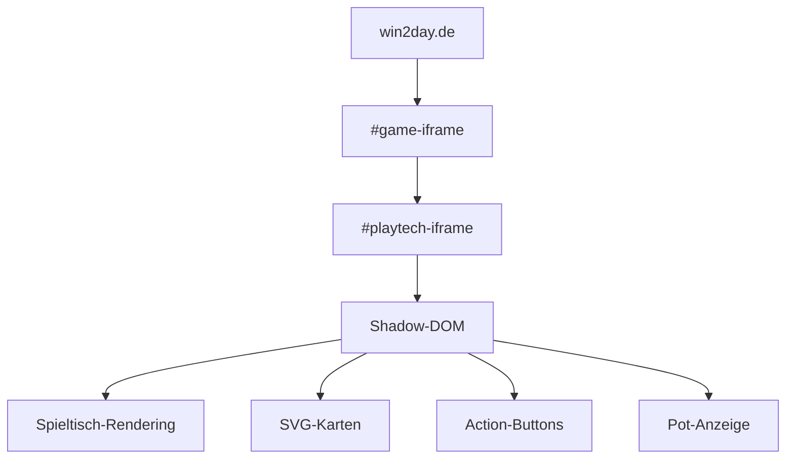

Playtech baut ihre Poker-Tische nicht für Bots. Das ist gut — denn genau das macht das Extrahieren von Spiel-Daten zu einem interessanten Problem.



Drei Iframes, ein Shadow-DOM, SVGs statt Text, und Zahlen die in `translateY()` Animationen versteckt sind. Das ist kein HTML — das ist ein Puzzle.

## Die 3 Iframe-Ebenen

### Layer 1: win2day.de (Host-Seite)
Der Portal-Container. Hier passiert nichts relevantes — nur Layout und Cookie-Banner.

### Layer 2: #game-iframe
Ein Zwischen-Iframe von win2day der die Spiele-App lädt. Enthält das Playtech-Wrapper-Script.

### Layer 3: #playtech-iframe (der heilige Gral)
Hier drin liegt der komplette Spieltisch. In einem **Shadow-DOM**.

```python
async def get_playtech_frame(page):
    """Durch die 3 Iframe-Ebenen navigieren."""
    # Ebene 1 → 2
    game_frame = page.frame_locator('#game-iframe')
    # Ebene 2 → 3  
    playtech_frame = game_frame.frame_locator('#playtech-iframe')
    return playtech_frame
```

## Shadow-DOM Parsing

Der Tisch lebt in einem `#shadow-root`. Playwright kann Shadow-DOM direkt via `page.evaluate()` ansprechen — das ist der Grund warum Playwright gewonnen hat (Selenium hätte hier gebraucht).

```javascript
// Der Code der im Browser läuft:
const root = document.querySelector('#playtech-root').shadowRoot;
const tableHtml = root.innerHTML;
```

Ich parsiere den Shadow-DOM-Inhalt mit Regex und DOM-Traversierung:

```python
def parse_shadow_dom(shadow_html: str) -> dict:
    result = {}
    
    # Hole Cards: SVG-Pfade im Spielerbereich
    hole_cards_match = re.search(
        r'class="player-hole-cards".*?>(.*?)</div>',
        shadow_html, re.DOTALL
    )
    if hole_cards_match:
        result['hero_hand'] = extract_cards_from_svgs(
            hole_cards_match.group(1)
        )
    
    # Pot: Der Betrag in der Pot-Anzeige
    pot_match = re.search(
        r'class="pot-amount"[^>]*>([^<]+)',
        shadow_html
    )
    if pot_match:
        result['pot'] = parse_pot(pot_match.group(1))
    
    # Buttons: Sind Aktionen verfügbar?
    result['buttons'] = extract_button_states(shadow_html)
    
    return result
```

## SVG-Karten erkennen

Playtech rendert Karten als SVG-Pfade. Ein Ass-Symbol hat einen bestimmten Pfad, ein König einen anderen. Ich vergleiche die SVG-Pfad-Signaturen:

```python
CARD_SVG_SIGNATURES = {
    # Vereinfacht: SHA256 des SVG-path-Strings
    'a1b2c3d4...': ('A', 's'),  # A♠
    'e5f6g7h8...': ('K', 'h'),  # K♥
    'i9j0k1l2...': ('Q', 'd'),  # Q♦
    # ... 52 Einträge
}

def identify_card(svg_path: str) -> Card:
    sig = hashlib.sha256(svg_path.encode()).hexdigest()[:16]
    rank, suit = CARD_SVG_SIGNATURES.get(sig, (None, None))
    if rank is None:
        logger.warning(f"Unbekannte Karte: {sig}")
        return None
    return Card(rank, suit)
```

**Warum das funktioniert:** Playtech verwendet für jede Karte einen **fixen SVG-Pfad**. Solange sie das Rendering nicht ändern, bleiben die Signaturen stabil. Wenn sie es ändern — Update der Signaturen.

## Die JS-Funktion `_JS_TABLE_STATE`

Der Goldfund: Im Playtech-Iframe liegt eine globale JS-Funktion `_JS_TABLE_STATE` die ein serialisiertes JSON mit allen Spiel-Informationen zurückgibt. Kein DOM-Parsing nötig.

```javascript
const state = _JS_TABLE_STATE();
// → { phase: 'preflop', heroHand: ['As','Ks'], 
//     board: [], pot: 250, ... }
```

**Problem:** Die Funktion ist nicht immer verfügbar (manchmal undefined) und das JSON-Format ist undokumentiert. Ich nutze sie als primäre Quelle und den DOM-Reader als Fallback.

```python
async def get_table_state(page) -> dict:
    """Primär: _JS_TABLE_STATE, Fallback: DOM-Parsing."""
    try:
        state = await page.evaluate('_JS_TABLE_STATE()')
        if state and 'phase' in state:
            return normalize_state(state)
    except Exception:
        pass
    return await parse_dom_manually(page)
```

## Warum `.action-fold` NICHT der Button ist

Das war der Bug der mich 2 Tage gekostet hat.

```css
/* In den Playtech-Styles: */
.action-fold { cursor: pointer; background: #ff4444; }
/* DER DAT SIEHT AUS WIE EIN BUTTON */
```

Aber es ist ein `<div>` im Shadow-DOM das nur die visuelle Hover-Animation steuert. Der **echte** Button ist:

```html
<div id="FOLD" class="action-button" data-action="fold">
  <input id="FOLD.pre-action-toggle" type="button" value="Fold">
</div>
```

Der Bot muss auf `div#FOLD.action-button` klicken, nicht auf `.action-fold`. Der `.action-fold` ist ein CSS-Selector der 3 Layer über dem Shadow-DOM liegt und nur die Farb-Animation triggert. Wenn du draufklickst passiert — nichts.

```python
# FALSCH:
await page.click('.action-fold')  # Tut nichts, nur Animation

# RICHTIG:
await shadow_root.locator('div#FOLD.action-button').click()
```

## Hash-basierter Stabilitätsfilter

Größtes Problem: **Deal-Animationen**. Playtech aktualisiert das Board nicht atomar. Karten fliegen nacheinander ein. Der Bot sieht Frame 1: [A♠], Frame 2: [A♠ K♠], und denkt "Turn?".

Lösung: Ein Hash-Stabilitätsfilter der nur feuert wenn sich der Content für 500ms nicht ändert:

```python
class StabilityFilter:
    def __init__(self, stability_ms=500):
        self._last_hash = None
        self._stable_hash = None
        self._timer = None
        self._stability_ms = stability_ms
    
    def feed(self, raw_html: str):
        h = hashlib.md5(raw_html.encode()).hexdigest()
        if h == self._last_hash:
            return  # Keine Änderung — warten
        self._last_hash = h
        # Timer reset — warte auf Stabilität
        if self._timer:
            self._timer.cancel()
        self._timer = asyncio.create_task(
            self._emit_after_stable(h)
        )
    
    async def _emit_after_stable(self, h):
        await asyncio.sleep(self._stability_ms / 1000)
        self._stable_hash = h
        # Hier: State parsebar und stabil
        await self._on_stable.emit()
```

## Ergebnisse

| Metrik | Wert |
|--------|------|
| Erkennungsrate | ~99.7% aller Karten korrekt |
| DOM-Scan-Latenz | 200-400ms |
| Stabilitätsfilter-Durchlässigkeit | 0 Deal-Animation-Durchrutscher in 10k Händen |
| JS-Funktion Verfügbarkeit | ~85% der Reads |
| Fallback-Häufigkeit | ~15% (wenn _JS_TABLE_STATE nicht da) |

## Fazit

Der DOM-Reader ist das Modul mit dem höchsten Wartungsaufwand. Playtech kann ihr Rendering jederzeit ändern und meine Signaturen sind kaputt. Aber so ist das mit Browser-Automation — du baust auf Sand.

Solange es funktioniert: 99.7% Erkennungsrate bei 200-400ms. Reicht um Entscheidungen zu treffen bevor der Timer abläuft.

Nächstes Mal: Wie der Stabilitätsfilter Deal-Animationen besiegt — und warum eine einzige flackernde Karte den Bot fast zerstört hat.