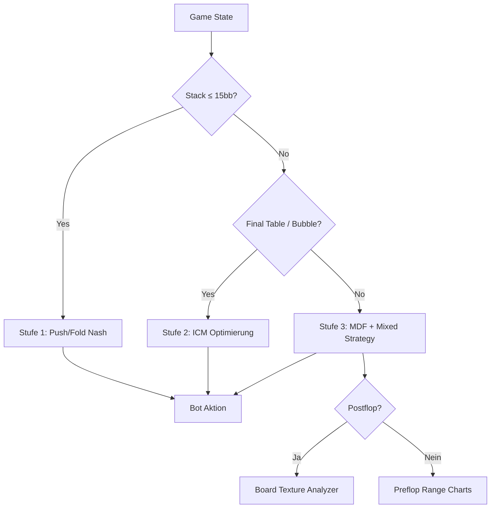

Drei Stufen. Drei völlig verschiedene Algorithmen. Eine Entscheidung.



Jede Stufe hat ihre Daseinsberechtigung. Und ja — manchmal überschneiden sie sich. Dann gewinnt konservativ.

## Stufe 1: Push/Fold Nash (3-40bb)

Wenn der Stack klein ist, vereinfacht sich Poker drastisch. Keine Postflop-Spielereien — nur Push oder Fold.

Die Nash Equilibria für Push/Fold sind gut erforscht. Ich nutze eine adaptierte Version der Tabellen von Will Tipton und StealTheBlinds.

**Wie es funktioniert:**

```python
class PushFoldSolver:
    def __init__(self):
        self._tables = self._load_nash_tables()
        # 3-40bb in 1bb-Schritten für jede Position
    
    def solve(self, state: GameState) -> Action:
        stack_bb = state.hero_stack / state.bb_size
        position = self._normalize_position(state.hero_seat)
        
        push_range = self._tables.get_push_range(
            stack_bb=stack_bb,
            position=position,
            players_to_act=state.players_behind,
        )
        
        if state.hero_hand in push_range:
            return Action.PUSH
        return Action.FOLD
```

**Parameter:** 3-40bb in 1bb-Schritten (3-20bb granular, 20-40bb in 2bb-Schritten). 6 Positionen (UTG, MP, CO, BTN, SB, BB). Für jede Position: Push-Range + Call-Range.

**Die Tabellen sind nicht statisch.** Ich passe sie dynamisch an Gegner-Tendenzen an. Gegen einen Calling Station (callt zu viel) enge ich die Push-Range ein und weite die Value-Hände. Gegen einen Nit (foldet zu viel) pushe ich weiter.

**Warum 40bb Limit?** Weil Nash Push/Fold ab ~25bb gegen gute Spieler nicht mehr optimal ist. Ab 40bb ist es reines -EV zu pushen. Die Grenze ist bewusst konservativ gesetzt.

## Stufe 2: ICM (Final Tables / Bubbles)

Chip EV ≠ Dollar EV. Das ist die Kern-Erkenntnis von ICM (Independent Chip Model).

Ein Beispiel: Du hast 10bb auf der Bubble von einem 9-Mann-Turnier. 3 Plätze zahlen. Du überlegst zu callen — aber wenn du verlierst, bist du raus ohne Geld. Deine Chips sind weniger wert als es aussieht.

**Exakte Berechnung (≤5 Spieler):**

```python
def exact_icm(stacks: list[float], payouts: list[float]) -> list[float]:
    """
    Berechnet $EV für jeden Spieler exakt.
    Nur bis ~5 Spieler praktikabel (n!-Explosion).
    """
    n = len(stacks)
    # Rekursiver Algo: Jede mögliche Finish-Reihenfolge
    # O(n!) — bei 5 Spielern: 120 Permutationen. OK.
    # Bei 9 Spielern: 362.880 — zu viel.
    return compute_icm_recursive(stacks, payouts)
```

**Monte-Carlo (6+ Spieler):**
```python
def mc_icm(stacks: list[float], payouts: list[float], 
           iterations: int = 100_000):
    """ICM via Monte-Carlo Simulation."""
    results = {i: 0.0 for i in range(len(stacks))}
    for _ in range(iterations):
        order = simulate_finish_order(stacks)
        for rank, player in enumerate(order):
            results[player] += payouts[rank] / iterations
    return results
```

**Spin&Go (100/0):** Spezialfall. 3 Spieler, 100% für Platz 1, 0% für Platz 2+3. Hier ist das ICM Modell extrem — der Bubble-Faktor ist maximal hoch.

```python
def spin_and_go_icm(stacks: list[float]) -> dict:
    """100/0 Payout: Nur gewinnen zählt."""
    # Vereinfacht: Gewinnwahrscheinlichkeit ≈ Stack-Anteil
    total = sum(stacks)
    win_prob = [s/total for s in stacks]
    # $EV = win_prob * 100% + 0 * (1-win_prob)
    # → Du brauchst 67% Equity um einen All-in zu callen
    #   wenn du gedeckt bist (denn Verlieren = 0$)
    return {i: wp * ENTRY_FEE * 3 for i, wp in enumerate(win_prob)}
```

## Stufe 3: MDF + Board Texture + Mixed Strategy

Das ist die **Standard-Engine** — für alles was nicht Shortstack oder Bubble ist.

### MDF (Minimum Defense Frequency)

"Wie oft muss ich verteidigen damit mein Gegner nicht mit jeder Hand profitabel bluffen kann?"

```python
def mdf(bet_size: float, pot: float) -> float:
    """Minimum Defense Frequency = 1 - (bet/(bet+pot))."""
    return 1 - (bet_size / (bet_size + pot))

# Beispiel:
# Pot = 100, Bet = 75
# MDF = 1 - (75/(75+100)) = 1 - 0.428 = 0.572
# → Du musst zu 57.2% callen oder raisen, 
#   sonst kann Gegner profitabel jede 2-7 bluffen
```

### Alpha + Bluff-to-Value Ratio

"Wie oft muss ein Bluff funktionieren um profitabel zu sein?"

```python
def alpha(bet_size: float, pot: float) -> float:
    """Alpha = bet/(bet+pot). Minimale Fold-Equity für Breakeven."""
    return bet_size / (bet_size + pot)

def bluff_to_value_ratio(bet_size: float) -> float:
    """B:V = bet/(pot+2*bet). Optimaler Bluff-Anteil."""
    return bet_size / (1 + 2 * bet_size)

# Standard Bet Sizings:
# 33% Pot:  B:V = 0.33/(1+0.66) = 20% Bluffs
# 50% Pot:  B:V = 0.50/(1+1.00) = 25% Bluffs  
# 66% Pot:  B:V = 0.66/(1+1.32) = 28% Bluffs
# 100% Pot: B:V = 1.00/(1+2.00) = 33% Bluffs
```

### Board Texture Integration

Der Engine-Teil der zeigt dass ich ADHS habe — ich konnte nicht aufhören Details zu pushen:

- **Paired Boards** (z.B. K♠K♣T♥): Weniger Bluffs, weil Full House Draws existieren
- **Coordinated Boards** (z.B. J♠T♠9♣): Mehr Draws, weniger Value-Bets
- **Dry Boards** (z.B. K♠7♣2♦): Mehr C-Bets, weil wenig Draws
- **Monotone Boards** (z.B. A♠K♠3♠): Weniger Aggression, wegen Flush-Draws
- **Rainbow Boards:** Standard Texture Play

### Mixed Strategy via MD5

Der interessanteste Part. Reine GTO-Strategien sind deterministisch — ein Bot der immer gleich spielt ist ausbeutbar. Also mische ich Strategien über einen deterministischen Seed:

```python
def mixed_strategy(state: GameState, options: list[Option]) -> Option:
    """
    Mixed Strategy via MD5-Hash des Game-States.
    Gleicher State → gleiche Zufallszahl (reproduzierbar).
    Unterschiedlicher State → andere Mischung.
    """
    state_hash = hashlib.md5(
        f"{state.hand_id}:{state.hand}:{state.board}:{state.phase}"
        .encode()
    ).hexdigest()
    seed = int(state_hash[:8], 16)
    rng = random.Random(seed)
    
    # Weighted Random Selection
    total = sum(opt.weight for opt in options)
    r = rng.random() * total
    cumulative = 0
    for opt in options:
        cumulative += opt.weight
        if r <= cumulative:
            return opt
    
    return options[-1]
```

**Warum MD5 und nicht `random.random()`?** Weil MD5 deterministisch ist: Gleicher State → gleiche "Zufalls"-Entscheidung. Das macht Debugging möglich — reproduziere eine Hand, bekomme dieselbe Bot-Entscheidung.

### CFR Spot Library (Postflop)

Die Engine hat eine wachsende Library von vorsimulierten CFR-Spots für Standard-Situationen:

```python
CFR_SPOT_LIBRARY = {
    # (Position, StackSize, BoardTexture, SPR) → (Bet%, Bluff%)
    'CO_vs_BTN_50bb_coordinated_deep': (0.66, 0.28),
    'BTN_vs_SB_40bb_dry_medium':       (0.50, 0.25),
    'BB_vs_CO_30bb_paired_low':         (0.33, 0.20),
    # ... weitere Spots
}
```

Aktuell ~200 Spots. Wachsend.

## Die Entscheidungs-Matrix (Zusammenfassung)

| Situation | Engine | Entscheidungs-Grundlage |
|-----------|--------|------------------------|
| Stack ≤ 15bb | Push/Fold Nash | Nash Equilibrium Tabellen |
| Bubble / Final Table | ICM | $EV statt Chip EV |
| Alle anderen | MDF + Mixed Strategy | Pot Odds, Board Texture, Range |
| Postflop Standard | CFR Spot Library | Vorsimulierte Equilibria |
| Edge Cases | MDF | Konservativ folden |

## Aktuelle Performance

| Stufe | Entscheidungszeit | Genauigkeit (vs Solver) |
|-------|------------------|------------------------|
| Push/Fold | <1ms | ~98% (Nash-Tabellen) |
| ICM (exakt) | ~5ms | 100% (mathematisch exakt) |
| ICM (MC) | ~50ms (100k Sims) | ~99.5% |
| MDF + Texture | <5ms | ~92% (vs PioSolver) |
| Mixed Strategy | <1ms | N/A (absichtlich suboptimal) |

Der Bot gewinnt nicht immer. Aber er **verliert selten dumm**. Das ist der Punkt.